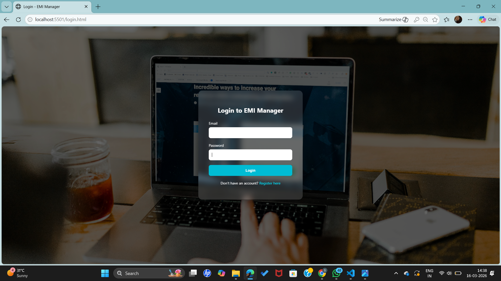
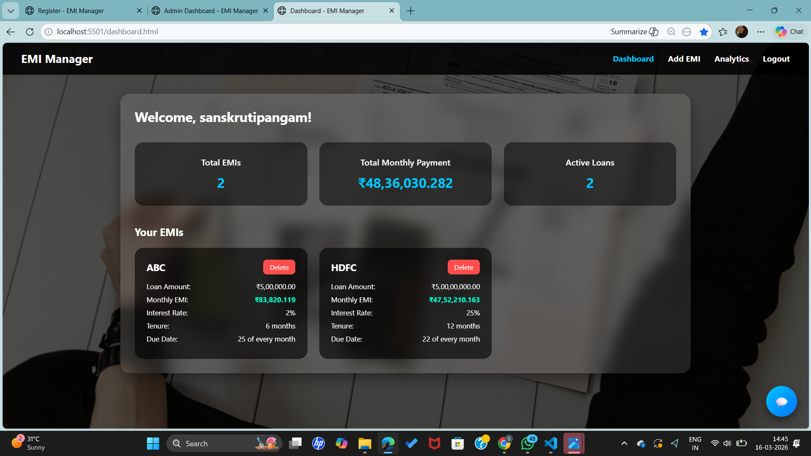
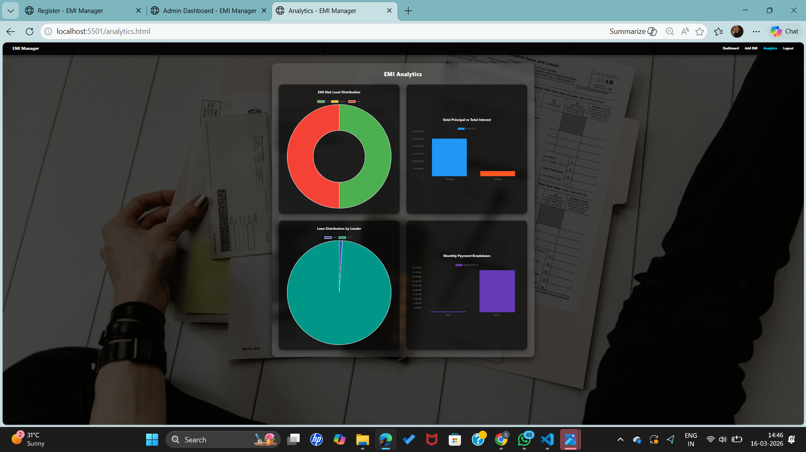
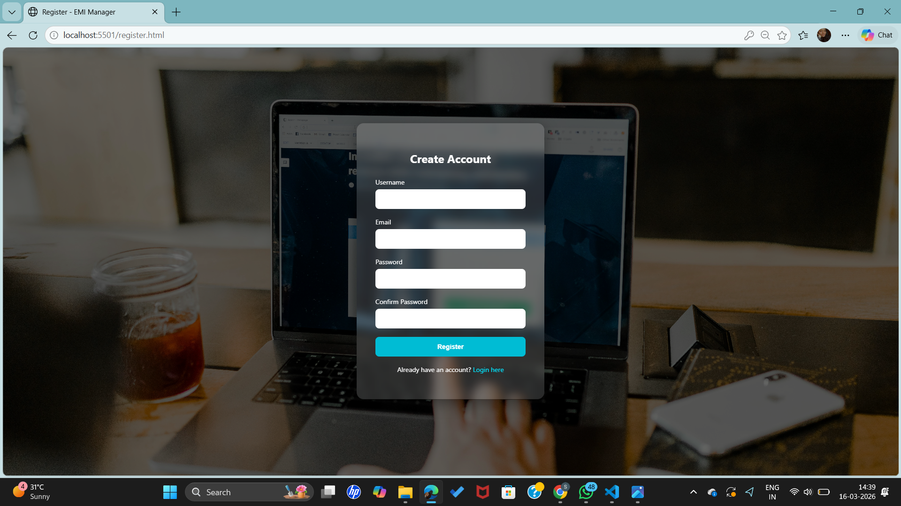
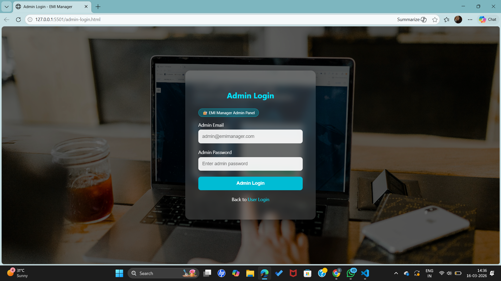
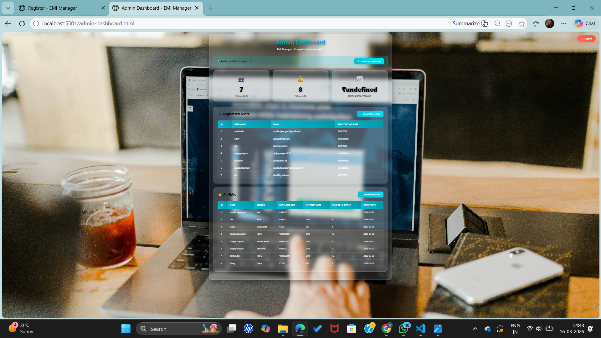

# EMI Management System

## Project Description
The EMI Management System is a web-based application designed to help users manage and track their EMI (Equated Monthly Installment) payments efficiently.

The system allows users to add EMI records, monitor payment status, and organize financial data in a structured way. It simplifies EMI tracking and helps users maintain organized financial records while reducing the chances of missing installment payments.

---

## Live Demo

Live demo will be available soon.

For now, the project can be run locally using the instructions below.

---

## Features

- Add new EMI records
- View all EMI details
- Track monthly installment payments
- Update EMI payment status
- Manage borrower information
- Organized record keeping

---

## Project Structure

Emi-Management-System
│
├── auth.js
├── config.js
├── dashboard.html
├── edit_emi.html
├── emi.js
├── login.html
├── register.html
├── server.js
├── style.css
├── users.db
└── emis.db

---

## Technologies Used

- HTML – Structure of web pages
- CSS & Bootstrap 5 – Styling and layout
- JavaScript – Client-side functionality
- Node.js – Server-side logic
- NeDB – Database for storing EMI records

---

## System Modules

### Admin Module

- Manage EMI records
- Download EMI records
- View all borrower details

### User Module

- Add EMI information
- Track installment payments
- View payment history

---

## Installation

1. Clone the repository
git clone https://github.com/sanskrutipangam27/Emi-Management-System.git

2. Navigate to the project directory
cd Emi-Management-System

3. Install project dependencies
npm install

---

## Running the Project

Start the server using:
node server.js

Then open your browser and go to:
http://localhost:5501

---

## Screenshots

### User Login

### User Dashboard

### User Analytics

### Registration Page

## Admin Login

##Admin Dashboard

---

## How the System Works

- The user enters EMI details such as loan amount, interest rate, and duration.
- The system stores the data in the database.
- Users can view EMI records and track monthly payments.
- The admin can view payment status and download records in CSV format.

---

## Advantages

- Easy EMI tracking
- Organized financial record management
- Reduces chances of missing payments
- Simple and user-friendly interface

---

## Future Improvements

- Email or SMS payment reminders
- EMI calculator integration
- Payment gateway integration
- Mobile responsive design

---

## Author

Sanskruti Pangam  
IT Student | Developer

---

## License

This project is created for educational purposes.

---

## Support

If you find this project useful, consider starring the repository.

